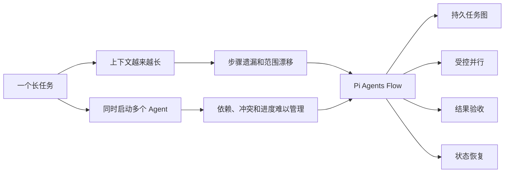
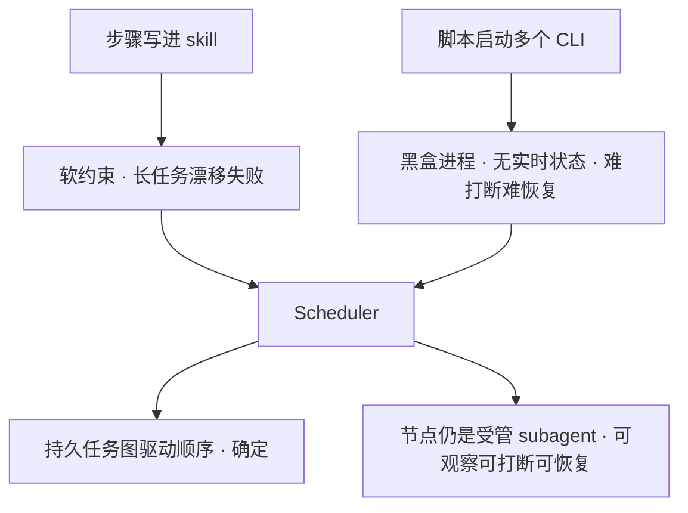
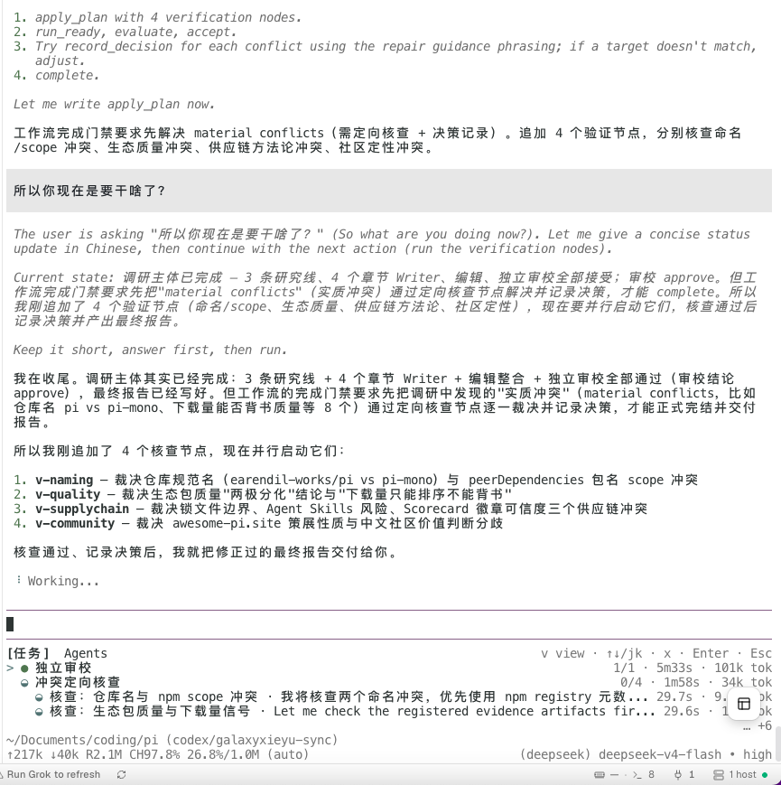
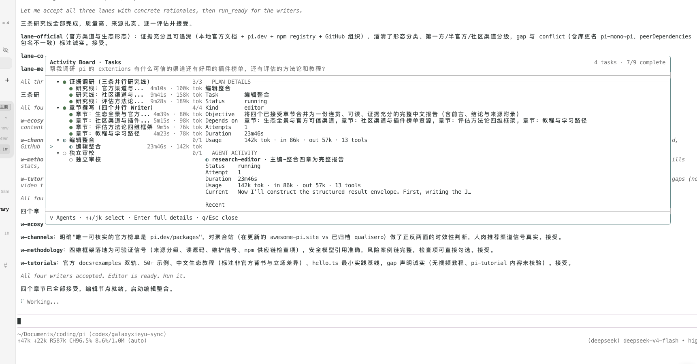
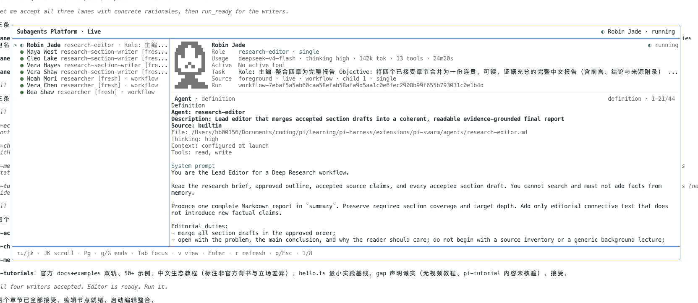
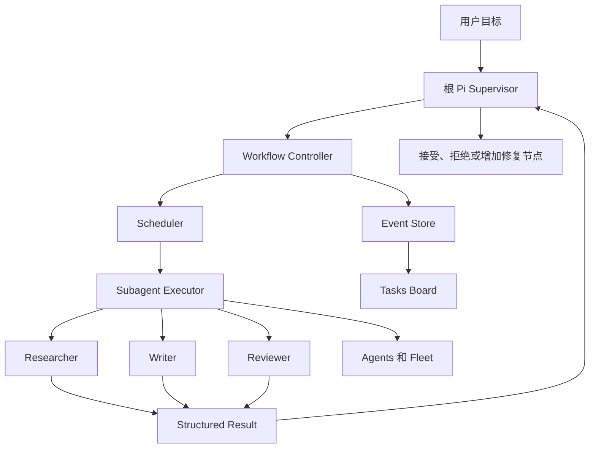
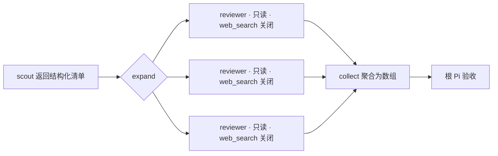

# Pi Agents Flow

Pi Agents Flow 是一个运行在 Pi 内部的多 Agent 插件。根 Pi 负责拆任务、安排顺序和验收结果，子 Agent 各自完成一段明确的工作。任务可以并行，也可以按依赖顺序推进，运行过程会持续显示在终端里。

## 为什么做这个插件

一个 Agent 处理短任务很方便。任务拉长以后，问题开始出现。

调研、实现、检查和修改都挤在同一段上下文里，前面的要求会逐渐变远。模型可能漏掉步骤，也可能在没有完成验证时直接交付。把工作分给多个 Agent 能缓解上下文压力，但马上会带来新的问题。谁先做，谁可以并行，结果冲突时听谁的，一个进程中断以后从哪里继续，这些事情需要有人管。



Pi Agents Flow 把任务、依赖、执行记录和验收决定保存下来。根 Pi 仍然负责判断，插件负责让执行顺序和当前状态有据可查。

## 为什么需要一个 scheduler

在做出 scheduler 之前，我们试过两种更直接的做法，各自都撑不住长任务。

第一种是把步骤直接写进 skill，让模型照着 skill 里的流程一步步走。短任务没问题，任务一长就开始失效：步骤对模型只是软约束，上下文越长越容易漂移、漏步或提前收尾。要靠一段 prompt 稳定地驱动一个多阶段流程，不确定性太强。

第二种是用脚本启动多个 CLI 进程来硬编码推进顺序。确定性有了，但每个进程都是黑盒。没有统一的实时状态，看不到某个 child 正在做什么，也不好在中途打断、改方向或从断点恢复——相当于失去了 subagent 的体验。

Scheduler 就是为了同时拿到这两边的好处。执行顺序和依赖由它按持久任务图推进，这一层是确定的，不依赖模型记住流程；而每个节点仍然是受管的 subagent，状态实时可见，可以随时打断、纠偏和恢复。



## 运行到哪里，一眼能看到

下面这次任务已经完成主体研究，但材料里还有四处冲突。根 Pi 增加了四个核查节点，没有直接生成最终报告。底部的 Activity Dock 会一直显示当前阶段、正在运行的节点和剩余工作。



这块界面解决的是长任务最常见的困扰。用户不必翻聊天记录，也能知道系统现在为什么还没有结束。

## Tasks 看计划

Tasks 视图展示任务结构。研究、章节写作、编辑和审核各自占据明确的位置。尚未启动的 Work Unit 留在计划中，已经运行的节点会显示 attempt、耗时和 token。



这张图里，三条研究线和四个章节 Writer 已经完成，Editor 正在整合，独立 Reviewer 还没有启动。计划和实际进度放在一起，先后关系不会只存在于根 Pi 的上下文里。

## Agents 看执行

Agents 和 Fleet 只展示已经分配的 child。选中一个员工以后，可以查看它的真实 Agent 类型、任务、模型、工具权限、system prompt 和实时 transcript。



截图中选中的是 `research-editor`。它只能读取和写入，不能自行搜索。编辑工作因此只能使用前面已经接受的研究材料。员工名和头像来自稳定的 execution identity，同一个 child 在 Activity Board 和 Fleet 中不会换人。显示语言跟随当前 Workflow。

## 系统怎样工作

Pi Agents Flow 分成两部分。执行层负责启动和管理 child，Workflow 层负责任务图、状态和验收。Workflow 不会另外实现一套 Agent runtime，它复用同一个 Subagent Executor。



普通委派支持 single、parallel、chain、foreground 和 background。复杂任务可以使用持久化 Workflow。每个节点都能限制模型、上下文、工具和预算。Child 完成以后，根 Pi 还要决定接受、拒绝或补一次验证。

Workflow 的事件写入 `events.jsonl`。终端退出、Pi reload 或任务暂停以后，Controller 可以根据这些记录恢复当前状态。Activity Board、Todo 和 `manifest.json` 都是从运行记录生成的视图。

## 动态编排 subagent、skills 和 tools

手写多 Agent 编排是长任务里最累的一环。每加一个角色，就要重复定义它读什么、写什么、能用哪些 skill、预算多少，还要把上一步的产物手工喂给下一步。角色一多，这些细节很容易写错，也很难复用。

Workflow 把这件事变成可编排的结构，而不是每次重写。

- 每个节点自己声明 `agent`、`skill`、`tools`、`model` 和 `toolBudget`。根 Pi 在编排时决定某个角色只读不写、只调研不实现，或者只挂某一个 skill，节点之间互不影响。
- 节点的能力上限由 capability ceiling 收敛。编排给出的工具和 skill 不会超过员工自身声明的边界，越权的授权会在 preflight 阶段被拒绝。
- 子 Agent 不必事先全部写死。`expand` / `parallel` / `collect` 可以从上一步的结构化输出里动态展开：上一步返回一组文件或一组待核查项，Workflow 就按数据实时生成对应数量的 subagent，跑完再把结果聚合成一个数组交回根 Pi。
- 编排层顺带解决了上下文膨胀。Agent、流程性 skill 和 MCP 工具堆多了以后，全部塞进同一个上下文会稀释注意力、拉低输出质量，还白白烧 token。在编排层给每个节点只挂它这一步真正需要的 skill 和工具，无关的能力根本不会进入这个节点的上下文——质量和 token 消耗都在编排时就被优化掉，而不是等运行时再补救。



结果是编排本身成了唯一需要维护的东西。你优化一个编排 skill，就等于优化了它下面所有 subagent 的角色、权限和衔接方式，而不用再逐个手写和对齐。

## 怎样开始用

先从自然语言委派开始，不需要手写工作图。

```text
Use scout to inspect the authentication flow. Do not edit files.
```

```text
Run parallel reviewers. One checks correctness, one checks tests, and one checks unnecessary complexity.
```

任务需要固定顺序时，可以让 scout 先调查，再让 planner 制定计划。需要保留任务图和验收记录时，再使用 Workflow。

```text
/coding plan 为当前模块制定实现计划，不修改代码
```

```text
/deep-research 调研某个技术方案并输出带来源的报告
```

运行时从 Activity Dock 进入 Tasks 或 Agents。Tasks 用来看整体工作，Agents 用来看已经分配的员工，Fleet 用来看一个 child 的执行细节。

## 更远的方向

这套动态编排现在跑在 Pi 终端里。协议稳定以后，它不必只停留在终端。

规划中的一步是通过 pi-server 把编排能力开放成 API。任务图、节点定义、执行状态和验收决定本来就是持久化的结构化数据，天然适合作为服务对外提供。有了这层 API，Web UI 可以直接驱动同一套编排和执行，而不是各自重造一遍。

再往后，可以在 Web UI 上做出 Dify 那样的可视化编排：把节点、依赖、skill 和工具权限拖出来连成图，底层仍然复用同一个 Subagent Executor 和任务图。终端负责当下的委派和干预，Web 负责可视化编排和协作，两端共享同一份运行记录。

这部分是未来工作，不属于首个公开版本的承诺范围。
