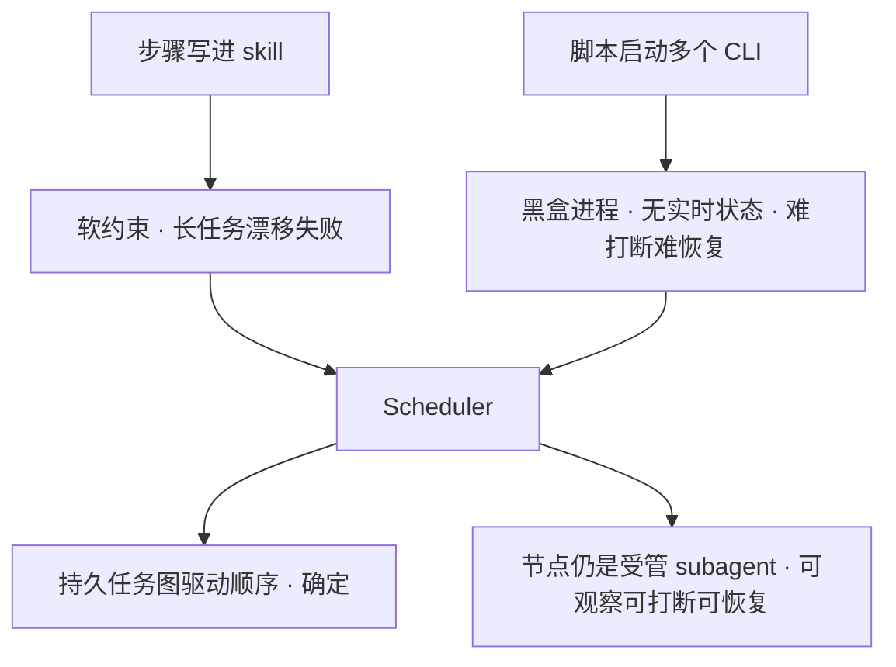
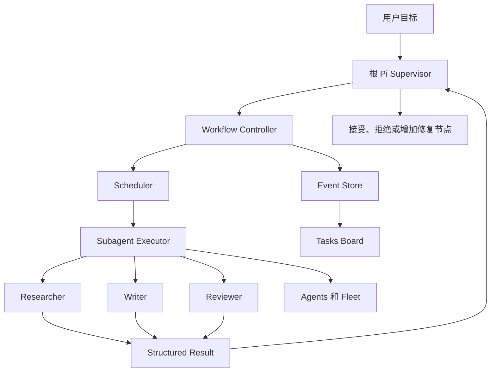
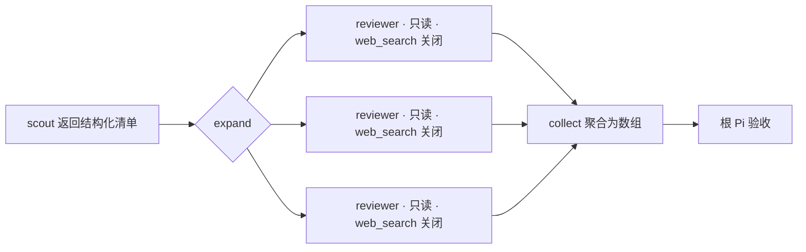

# Pi Agents Flow

Pi Agents Flow 是一个运行在 Pi 内部的多 Agent 编排插件。根 Pi 负责拆任务、安排顺序和验收结果，子 Agent 各自完成一段明确的工作。任务可以并行，也可以按依赖顺序推进，运行过程会持续显示在终端里。

## 痛点

先说清楚要解决的问题，对应能力在后面章节展开。

- 长任务全挤在一个上下文里：容易漂移、漏步，甚至没验证就交付；进程中断后也不知道从哪继续。
- 角色和 skill、工具越堆越多：模型每次选择都累、容易叫错人，无关能力还稀释质量、白烧 token。
- 手写多 Agent 编排又累又难复用，而且子任务的数量常常事先并不知道。

## 两个核心能力

说到底就是两件事，其他章节都是围绕它们展开的子功能。

### 一、编排（Agents flow）

把一个长任务拆成多个节点，用持久任务图记录顺序、依赖和验收决定；根 Pi 只负责判断，执行顺序和当前状态由插件托管，进程中断也能从事件日志恢复。

这一层的关键是 scheduler。在它之前我们试过两种更直接的做法，都撑不住长任务：把步骤写进 skill 让模型照着走，步骤只是软约束，任务一长就漂移、漏步、提前收尾；用脚本起多个 CLI 硬编码顺序，确定性有了，但每个进程是黑盒，没有统一的实时状态，也不好中途打断、改方向或断点恢复。scheduler 取两者之长——顺序和依赖由任务图确定，不依赖模型记流程；每个节点仍是受管的 subagent，实时可见、可打断、可恢复。



一个典型场景是“SOP 很硬、上下文却会爆”的任务，比如批量数据处理，或在大量样本里找 bad cases。步骤是固定的，必须按 SOP 一步步走，但要过的数据量很大；即便拆成多个 agent，主 agent 仍要逐条汇总和判断中间结果，上下文很快堆满。一旦主上下文膨胀，最后的验收 gate 就形同虚设——模型记不住判定标准、开始漏检。把 SOP 固化成任务图的节点和依赖后，结构和状态都在图里，主 Pi 不必把每条样本和中间产物都留在自己上下文里，gate 按节点独立执行，不会因为主上下文爆炸而失效。

编排的具体形态、动态展开和写法见后面的《系统怎样工作》《动态编排 subagent、skills 和 tools》和《编排语法》。

### 二、渐进式披露（skills 与 subagents）

默认把角色和能力都收窄，按需要再逐步放开，避免一次性把几十个 Agent 和一堆 skill、工具塞进同一段上下文，稀释质量、白烧 token。

`visibility` 决定 Agent 是否进入模型默认目录，`invocation` 决定 model / user 谁能调用；低频或危险角色可以隐藏，只留人手动用，或由 saved chain 按流程暴露。skill 同理：默认不继承全量目录，每个节点只挂它这一步真正需要的 skill 和工具，而且 skill 是惰性加载，匹配到任务才读全文。一个典型场景是你已经攒了几十个专用角色，外加一堆 skill 和 MCP 工具。全量暴露时，模型每次选角色都要扫一长串相似名称，既慢又容易叫错，每个 child 还被用不上的能力干扰、白烧 token。渐进式披露让日常只露出少量常用角色，专用或危险角色（比如数据库迁移）默认隐藏、只允许手动调用，每个节点也只挂它这一步真正需要的 skill 和工具。配置写法见后面的《配置可见性与 skill》。

## 运行到哪里，一眼能看到

下面这次任务已经完成主体研究，但材料里还有四处冲突。根 Pi 增加了四个核查节点，没有直接生成最终报告。底部的 Activity Dock 会一直显示当前阶段、正在运行的节点和剩余工作。


这块界面解决的是长任务最常见的困扰。用户不必翻聊天记录，也能知道系统现在为什么还没有结束。

## Tasks 看计划

Tasks 视图展示任务结构。研究、章节写作、编辑和审核各自占据明确的位置。尚未启动的 Work Unit 留在计划中，已经运行的节点会显示 attempt、耗时和 token。


这张图里，三条研究线和四个章节 Writer 已经完成，Editor 正在整合，独立 Reviewer 还没有启动。计划和实际进度放在一起，先后关系不会只存在于根 Pi 的上下文里。

## Agents 看执行

Agents 和 Fleet 只展示已经分配的 child。选中一个员工以后，可以查看它的真实 Agent 类型、任务、模型、工具权限、system prompt 和实时 transcript。


截图中选中的是 `research-editor`。它只能读取和写入，不能自行搜索。编辑工作因此只能使用前面已经接受的研究材料。员工名和头像来自稳定的 execution identity，同一个 child 在 Activity Board 和 Fleet 中不会换人。显示语言跟随当前 Workflow。

## 系统怎样工作

Pi Agents Flow 分成两部分。执行层负责启动和管理 child，Workflow 层负责任务图、状态和验收。Workflow 不会另外实现一套 Agent runtime，它复用同一个 Subagent Executor。



普通委派支持 single、parallel、chain、foreground 和 background。复杂任务可以使用持久化 Workflow。每个节点都能限制模型、上下文、工具和预算。Child 完成以后，根 Pi 还要决定接受、拒绝或补一次验证。

Workflow 的事件写入 `events.jsonl`。终端退出、Pi reload 或任务暂停以后，Controller 可以根据这些记录恢复当前状态。Activity Board、Todo 和 `manifest.json` 都是从运行记录生成的视图。

## 动态编排 subagent、skills 和 tools

手写多 Agent 编排是长任务里最累的一环。每加一个角色，就要重复定义它读什么、写什么、能用哪些 skill、预算多少，还要把上一步的产物手工喂给下一步。角色一多，这些细节很容易写错，也很难复用。

Workflow 把这件事变成可编排的结构，而不是每次重写。

- 每个节点自己声明 `agent`、`skill`、`tools`、`model` 和 `toolBudget`。根 Pi 在编排时决定某个角色只读不写、只调研不实现，或者只挂某一个 skill，节点之间互不影响。
- 节点的能力上限由 capability ceiling 收敛。编排给出的工具和 skill 不会超过员工自身声明的边界，越权的授权会在 preflight 阶段被拒绝。
- 编排是分层的：一个节点自己也可以是编排者，在受控范围内再调用和协调它自己的 subagent。“能调用哪些 subagent”和 tools、skills 属于同一套 scope——由 capability ceiling 的 `allowedAgents` 约束，并单调传播到嵌套子进程（子层能调的范围绝不会超过父层给的边界），再加一个可配置的嵌套深度上限。授权这一面用同一套 scope 就能兜住；顺序、冲突和何时算完仍由上层 supervisor 和验收 gate 负责。
- 子 Agent 不必事先全部写死。`expand` / `parallel` / `collect` 可以从上一步的结构化输出里动态展开：上一步返回一组文件或一组待核查项，Workflow 就按数据实时生成对应数量的 subagent，跑完再把结果聚合成一个数组交回根 Pi。
- 编排层顺带解决了上下文膨胀。Agent、流程性 skill 和 MCP 工具堆多了以后，全部塞进同一个上下文会稀释注意力、拉低输出质量，还白白烧 token。在编排层给每个节点只挂它这一步真正需要的 skill 和工具，无关的能力根本不会进入这个节点的上下文——质量和 token 消耗都在编排时就被优化掉，而不是等运行时再补救。



结果是编排本身成了唯一需要维护的东西。你优化一个编排 skill，就等于优化了它下面所有 subagent 的角色、权限和衔接方式，而不用再逐个手写和对齐。

## 快速调用

装到已有的 Pi 上，一行即可（需要 Node ≥ 22）：

```bash
pi install npm:pi-agents-flow
```

装好不用建 agent、不用写配置，直接用自然语言让 Pi 委派：

```text
用 reviewer 审一下这个 diff
让 scout 先摸清 auth 流程，再让 planner 出实现计划
```

想精确点名或带参数，用 slash 命令：

```text
/run reviewer "review this diff"
/run scout[model=deepseek-v4-flash] "audit the auth flow"
```

不确定有哪些角色时，用 `/subagents` 列出可用 Agent；跑起来后在底部 Activity Dock 看进度，进 Fleet 看某个 child 的细节。更完整的写法见下面的《编排语法》。

## 怎样开始用

先从自然语言委派开始，不需要手写工作图。

```text
Use scout to inspect the authentication flow. Do not edit files.
```

```text
Run parallel reviewers. One checks correctness, one checks tests, and one checks unnecessary complexity.
```

任务需要固定顺序时，可以让 scout 先调查，再让 planner 制定计划。需要保留任务图和验收记录时，再使用 Workflow。

```text
/coding plan 为当前模块制定实现计划，不修改代码
```

```text
/deep-research 调研某个技术方案并输出带来源的报告
```

运行时从 Activity Dock 进入 Tasks 或 Agents。Tasks 用来看整体工作，Agents 用来看已经分配的员工，Fleet 用来看一个 child 的执行细节。

## 编排语法

编排可以从自然语言一路收紧到持久任务图，按需要选择粒度。

最轻的是 slash 命令。`/run` 跑一个角色，`/chain` 按顺序推进，`/parallel` 并发：

```text
/run reviewer "review this diff"
/chain scout "scan the codebase" -> planner "make an implementation plan"
/parallel reviewer "check correctness" -> reviewer "check tests"
```

`/chain` 里可以用 `( a | b )` 写内联并行组，用 `[key=value]` 给每一步单独配置模型、读写、skill 或输出，用 `{outputs.name}` 把命名步骤的产物传给后面：

```text
/chain scout[output=context.md] "scan" -> (reviewer "correctness" | reviewer "tests")[concurrency=2] -> worker[reads=context.md] "apply fixes"
```

加 `--bg` 后台执行，加 `--fork` 让每个 child 从父会话分叉。

需要数据驱动或结构化结果时，用 `subagent({ ... })` 工具 API。它支持 single、`tasks`（并行）、`chain`，并能从上一步的结构化输出动态展开再聚合：

```jsonc
{ chain: [
  { agent: "scout", task: "Return { items:[{path,reason}] }", as: "targets", outputSchema: { type: "object" } },
  {
    expand:   { from: { output: "targets", path: "/items" }, item: "target", key: "/path", maxItems: 12 },
    parallel: { agent: "reviewer", task: "Review {target.path}. Reason: {target.reason}", outputSchema: { type: "object" } },
    collect:  { as: "reviews" },
    concurrency: 4
  },
  { agent: "worker", task: "Synthesize fixes from {outputs.reviews}" }
] }
```

要保留任务图、依赖和验收记录，就升级到持久 Workflow。入口是 `/workflow run`、`/coding` 和 `/deep-research`；根 Pi 通过 `workflow` 工具驱动状态：一次 `apply_plan` 提交完整的静态 DAG（节点用 `dependsOn` 表达顺序），`run_ready` 只调度就绪节点，完成后逐个 `accept` 或 `reject`。跑过一次、以后还要复用的图，可以 `/composition save` 存成模板，再用 `/composition run` 带参数重放。

## 自定义并触发 workflow

按“用几次、要不要留痕”选粒度，从轻到重三种。

一是一次性、动态：直接 `/workflow run <目标>`（或 `/coding`、`/deep-research`），由 supervisor 现场把目标拆成任务图执行，适合临时任务。

二是可复用的链（saved chain）：把固定流程写成一个 `.chain.md` 文件，放到项目 `.pi/chains/` 或用户 `~/.pi/agent/chains/`，用 `/run-chain` 触发。`{task}` 是你传入的任务，`{outputs.name}` 串联上一步的产物。

```md
---
name: scan-then-plan
description: 先摸代码再出计划
---

## scout
as: context
output: context.md

分析代码库：{task}

## planner
reads: context.md

基于 {outputs.context} 给出实现计划
```

```text
/run-chain scan-then-plan -- 重构鉴权模块
```

需要数据驱动的动态展开时改用 `.chain.json`（带 `expand` / `collect`），同样用 `/run-chain` 触发。

三是可复用的工作流模板（composition）：把一次跑通的任务图存成带参数的模板，之后带参重放。模板文件在 `<cwd>/.pi/agents-flow/compositions/<name>.json`，可以随项目提交。

```text
/composition save plan-dev-verify "先规划，再实现，最后验证"   # 从当前 run 存成模板
/composition list                                          # 看有哪些模板
/composition run plan-dev-verify --param targetModule=auth --param goal="修复登录超时"
```

注意 `/composition run` 是把模板 apply 到“当前活动的 workflow run”，并不会自己起一个 run，所以要先有一个活动 run（比如先 `/workflow run` 起一个）。模板里可以用 `{{param}}` 占位、用 `enableIf` 决定某个节点是否纳入，渲染时就把图定死，执行层拿到的是完全确定的 DAG。

## 配置可见性与 skill

这一节解决的是“角色和能力堆多了以后，反而拖累模型”的问题。

角色一多，所有 Agent 都进默认目录，模型每次委派前都要先扫一遍一长串相似名称，既占上下文，也更容易叫错人——尤其是那些低频或危险的角色（比如数据库迁移），你希望留着能手动用，但绝不想让模型自动路由到它。skill 同理：把全量 skill 目录和一堆工具无差别塞给每个 child，会稀释注意力、拉低输出质量，还白白烧 token。

Pi Agents Flow 的做法是把“看得见”“能调用”“能用哪些 skill”都变成可以按角色收窄的配置，默认窄、按需放。这些字段写在 agent frontmatter 里，或写在 `settings.subagents.agentOverrides.<name>` 里，不改角色本身。

先看 Agent 侧的两个字段：

- `visibility`：`default` 进入模型默认目录和 workflow 资产目录；`hidden` 从默认目录移除，但仍可被显式管理和受信任的用户调用。
- `invocation`：`both`（默认）、`model`、`user`、`disabled`。`user` 指 slash 命令和用户 prompt-template；`model` 指模型工具、workflow 委派、嵌套 fanout 和定时执行。

常见组合：低频角色隐藏起来、只留人手动调用，或可逆地停用一个角色。

```yaml
---
name: db-migrator
visibility: hidden      # 不进模型默认目录
invocation: user        # 只允许人手动 /run 调用
---
```

```jsonc
// 只调整策略，不改 agent 文件：写在用户或项目 settings
{ "subagents": { "agentOverrides": {
  "reviewer": { "visibility": "hidden" },
  "worker":   { "invocation": "disabled" }   // 可逆停用，角色仍可诊断可见
} } }
```

`invocation: "disabled"` 是可逆的执行策略，角色还在、便于排查；老的 `disabled: true` 是硬开关，直接从发现和 list 里移除。

skill 的可见性是同一套思路：默认收窄，按需给。

- `skills`：明确列出这个 agent 能用哪些 skill；运行时可用 `skill:` 覆盖，`skill: false` 全部关闭。
- `inheritSkills`：是否让 child 看到 Pi 发现到的全量 skill 目录，默认 `false`，保持窄。
- `skillPath`：只属于这个 agent 的私有 skill 发现目录，不会进入全局 skill 目录。

```yaml
---
name: researcher
inheritSkills: false     # 不继承全量 skill 目录
skills: deep-research    # 只挂这一个
skillPath: ./skills      # 私有发现目录，不外泄到全局
---
```

skill 是惰性加载：prompt 里只放 skill 的名称、描述和文件路径，只有当任务匹配时 agent 才用 `read` 读全文，所以挂 skill 不会一上来就吃满上下文。插件自带的编排 skill 只对根 Pi 可见，子 Agent 永远收不到，子上下文还会过滤掉父层的编排指令。

## 更远的方向

这套动态编排现在跑在 Pi 终端里。协议稳定以后，它不必只停留在终端。

规划中的一步是通过 pi-server 把编排能力开放成 API。任务图、节点定义、执行状态和验收决定本来就是持久化的结构化数据，天然适合作为服务对外提供。有了这层 API，Web UI 可以直接驱动同一套编排和执行，而不是各自重造一遍。

再往后，可以在 Web UI 上做出 Dify 那样的可视化编排：把节点、依赖、skill 和工具权限拖出来连成图，底层仍然复用同一个 Subagent Executor 和任务图。终端负责当下的委派和干预，Web 负责可视化编排和协作，两端共享同一份运行记录。

这部分是未来工作，不属于首个公开版本的承诺范围。
